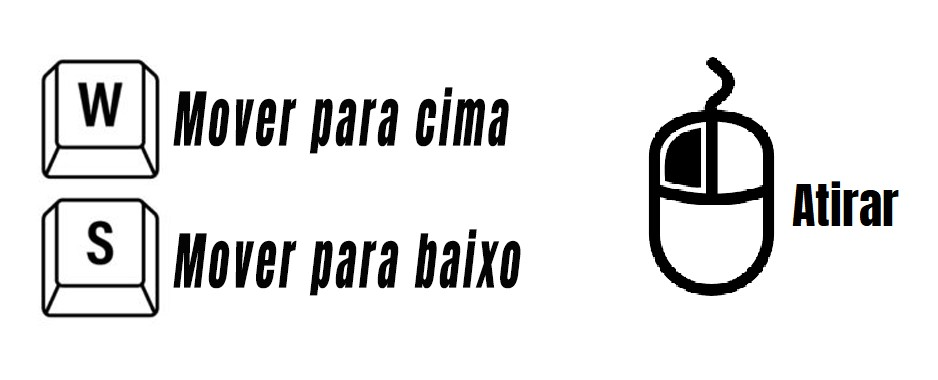
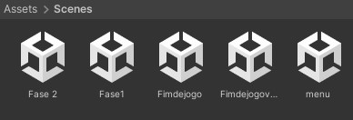
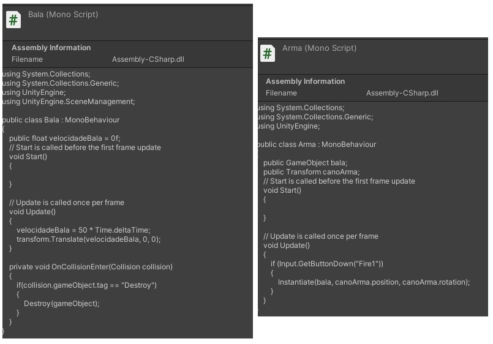
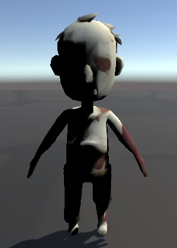
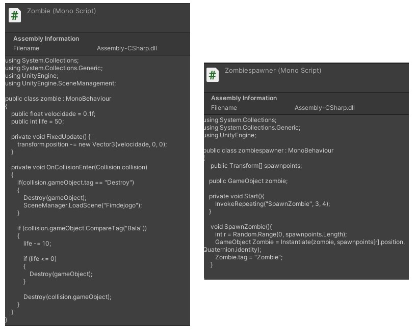
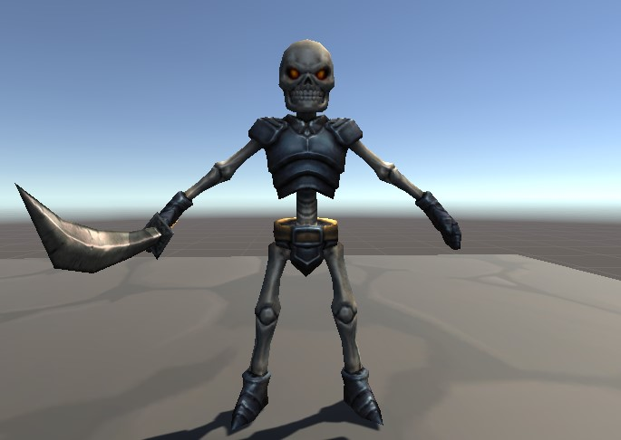
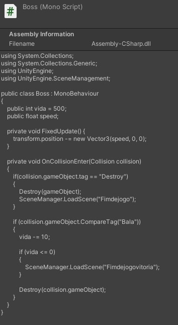

# Jogo Unity

Feito por Cauã Silva👦 e Juliana Dantas👩

2°Jogos Digitais🕹️

## Link do jogo no drive
https://drive.google.com/file/d/1jKhN5846LeQuEzGEf-Vc_4EgAPwARCT6/view?usp=sharing

## Vídeos mostrando o jogo
https://drive.google.com/file/d/1lr_Fz5KNc5L4wxyFL2Ih5-ScuXMqzLMY/view?usp=sharing

## Explicação 1°Fase

O jogador deve controlar o personagem (Michael) e derrotar os zumbis que vao surgindo sem deixá-los atravessar o limite. A cena muda após 1 minuto.

## Explicação 2°Fase

O jogador continua matando zumbis sem deixá-los atravessar o limite, porém, agora possui um boss com muita vida que ele precisa derrotar para vencer.

## Explicação projeto

O jogo possui 3 cenas, mas apenas 2 delas é o jogo, a outra é de fim do jogo.

Ao clicar em iniciar, a primeira cena "Fase1" se inicia.

Após completar um minuto matando os zumbis, a segunda cena se inicia "Fase2".

Se algum zumbi atravessou o limite, irá aparecer a cena com a tela de fim de jogo.

Se o jogador conseguir matar o boss, irá aparecer a cena com a tela de fim de jogo.

## Personagem

O personagem possui os scripts de movimento, arma e mudar cena.

O script de movimento irá movimentar o personagem no eixo Z, com o W e o S.

O script de arma é o que faz atirar, nele possui objetos como cano da arma e bala. O cano da arma é o responsável por ejetar varias balas que foram feitas utilizando sphere. Já a bala é composta por um script que faz o seu movimento, sua velocidade e um código para destrui-lá ao encostar nas bordas do cenário, pois as sphere vão sendo criadas a cada click do jogador e vai ter uma hora que vai ter tantas sphere que é capaz do jogo crashar. Além de ser responsável por destruir/matar os zumbis e o boss.

## Zumbis

O zumbi foi pego no Assets e ja veio com algumas animações e scripts. Nele adicionamos um script para movimentá-lo sozinho e fazer spawnar varios deles em lugares aleatórios em uma área do cenário. O zumbi também possui vidas, que são perdidas ao colidir com a "bala". Se ele colidir com o gameObject vazio que fica atrás do personagem, a cena é mudada para a área de derrota.

## Boss

O boss possui os mesmos códigos de movimento dos zumbis, o que muda é a sua velocidade e que ele possui mais vida. Se o boss perder todas as suas vidas, a cena é mudada para a área de vitória.

